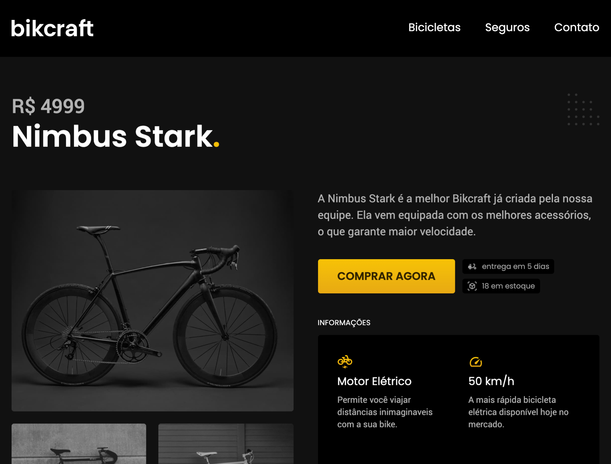

# Bikcraft

Este é um projeto de um site E-commerce de bicicletas chamado Bikcraft. O projeto foi desenvolvido como parte do curso da Origamid.

## Tecnologias Utilizadas

- HTML5 (com tags semânticas como `<nav>`, `<article>`, `<ul>`, etc.)
- CSS3
- Web Design Responsivo
- JavaScript

## Descrição

Página que destaca os produtos de bicicletas de alta qualidade oferecidos pela Bikcraft. O design é responsivo e foi desenvolvido com foco na usabilidade e na apresentação visual atraente.

---

**Nota:** Este projeto foi desenvolvido como parte de um curso da Origamid. Os produtos, marcas e informações presentes no site são fictícios e utilizados apenas para fins educacionais.
