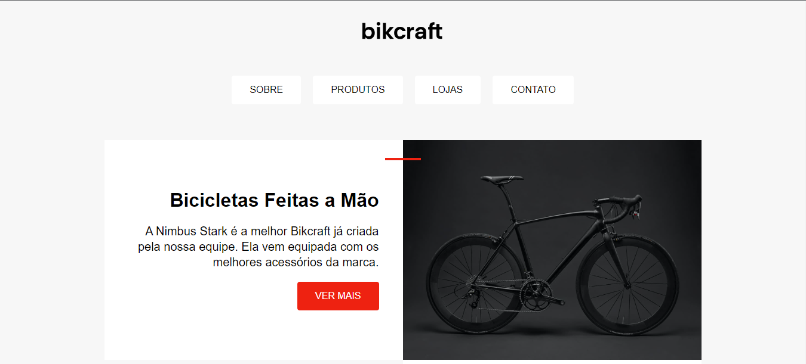

[Português](#PT) | [English](#en) | <a href="https://bikcraft-landing-page.vercel.app/">Live</a>

# Bikcraft Landing Page

##### PT :🇧🇷:

Este é um projeto de landing page para um site fictício de vendas de bicicletas chamado Bikcraft. O projeto foi desenvolvido como parte do curso da Origamid.

## Tecnologias Utilizadas

- HTML5 (com tags semânticas como `<nav>`, `<article>`, `<ul>`, etc.)
- CSS (utilizando propriedades modernas)

## Descrição

A Bikcraft landing page é uma página estática que destaca os produtos de bicicletas de alta qualidade oferecidos pela Bikcraft. O design é responsivo e foi desenvolvido com foco na usabilidade e na apresentação visual atraente.

 

# Bikcraft Landing Page

##### EN :us: :uk:

This is a landing page project for a fictional bicycle sales website called Bikcraft. The project was developed as part of the Origamid course.

## Technologies Used

- HTML5 (with semantic tags such as `<nav>`, `<article>`, `<ul>`, etc.)
- CSS (using modern properties)

## Description

The Bikcraft landing page is a static page that showcases high-quality bicycle products offered by Bikcraft. The design is responsive and has been developed with a focus on usability and appealing visual presentation.

